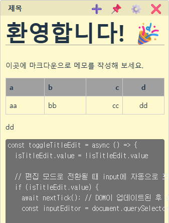
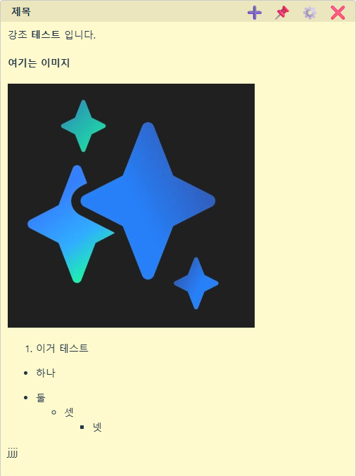

# 📝 마크다운 스티키 노트 (Markdown Sticky Notes)

Vue3, Vite, Electron을 활용하여 만든 데스크톱 마크다운 스티키 노트 애플리케이션입니다.

<br>




<br>

## ✨ 주요 기능

* **✍️ 마크다운 편집 및 미리보기**: 노트 본문을 **더블 클릭**하여 마크다운 `편집 모드`와 실시간 `미리보기 모드`를 손쉽게 전환할 수 있습니다.
* **🎨 자유로운 커스터마이징**:
    * **노트 제목**: 헤더의 제목을 **더블 클릭**하여 바로 수정할 수 있습니다.
    * **스타일 설정**: 설정(⚙️) 패널에서 각 노트의 **배경색**, **글자 크기**, **투명도**를 원하는 대로 꾸밀 수 있습니다.
* **🖼️ 편리한 창 관리**:
    * **독립된 창**: 각 노트는 개별 창으로 동작하여 화면 어디에나 자유롭게 배치하고 크기를 조절할 수 있습니다.
    * **항상 위에 표시**: 중요한 메모는 핀(📌) 기능을 통해 다른 모든 창 위에 항상 보이도록 고정할 수 있습니다.
* **📋 클립보드 이미지 붙여넣기**: 클립보드에 복사된 이미지를 편집기에 바로 붙여넣으면 (`Ctrl+V`), 이미지가 노트에 즉시 표시됩니다.
    * **운영체제 별 이미지 저장 장소**
        * **Windows**: `%APPDATA%/markdown-sticky-note/images`
        * **MacOS**: `~/Library/Application Support/markdown-sticky-note/images`
        * **Linux**: `$XDG_CONFIG_HOME/markdown-sticky-note/images` 또는 `~/.config/markdown-sticky-note/images`
* **💾 안전한 데이터 관리**:
    * **자동 저장**: 모든 변경사항은 앱 종료 시 자동으로 로컬에 저장됩니다.
    * **백업 및 복구**: 모든 노트를 `JSON` 파일 하나로 내보내거나 가져올 수 있습니다.
    * **노트 삭제**: 설정 패널을 통해 더 이상 필요 없는 노트를 완전히 삭제할 수 있습니다.
* **🚀 시스템 연동**:
    * **트레이 메뉴**: 작업 표시줄 트레이 아이콘으로 새 노트 생성, 닫은 노트 열기 등 핵심 기능에 빠르게 접근할 수 있습니다.
    * **로그인 시 자동 실행**: 컴퓨터 시작 시 앱을 자동으로 실행하도록 설정할 수 있습니다.


## 🛠️ 기술 스택


* **`Dependencies`**: `marked`, `lodash.debounce`, `uuid`
* **`DevDependencies`**: `electron-builder`, `vite-plugin-electron`, `vue-tsc`

## 🚀 설치 및 실행 방법

```bash
# 1. 저장소를 클론합니다.
git clone [https://github.com/ingmaginer/markdown-sticky-notes.git](https://github.com/ingmaginer/markdown-sticky-notes.git)

# 2. 프로젝트 폴더로 이동합니다.
cd markdown-sticky-notes

# 3. 의존성 패키지를 설치합니다.
npm install

# 4. 개발 모드로 앱을 실행합니다.
npm run dev

# 5. 앱을 빌드합니다. (Windows, Mac)
npm run build
```

* **중요**: `your-username` 부분은 본인의 GitHub 사용자 이름으로 변경해주세요.

## 📂 폴더 구조

```
.
├── build/
├── electron/
├── public/
├── src/
├── .gitignore
├── index.html
├── package.json
└── vite.config.ts
```

## ✍️ 만든 사람

* **유현호** ([@ingmaginer](https://github.com/ingmaginer)) | ingmagine03@gmail.com

## 📄 라이선스

이 프로젝트는 [MIT License](LICENSE)를 따릅니다.